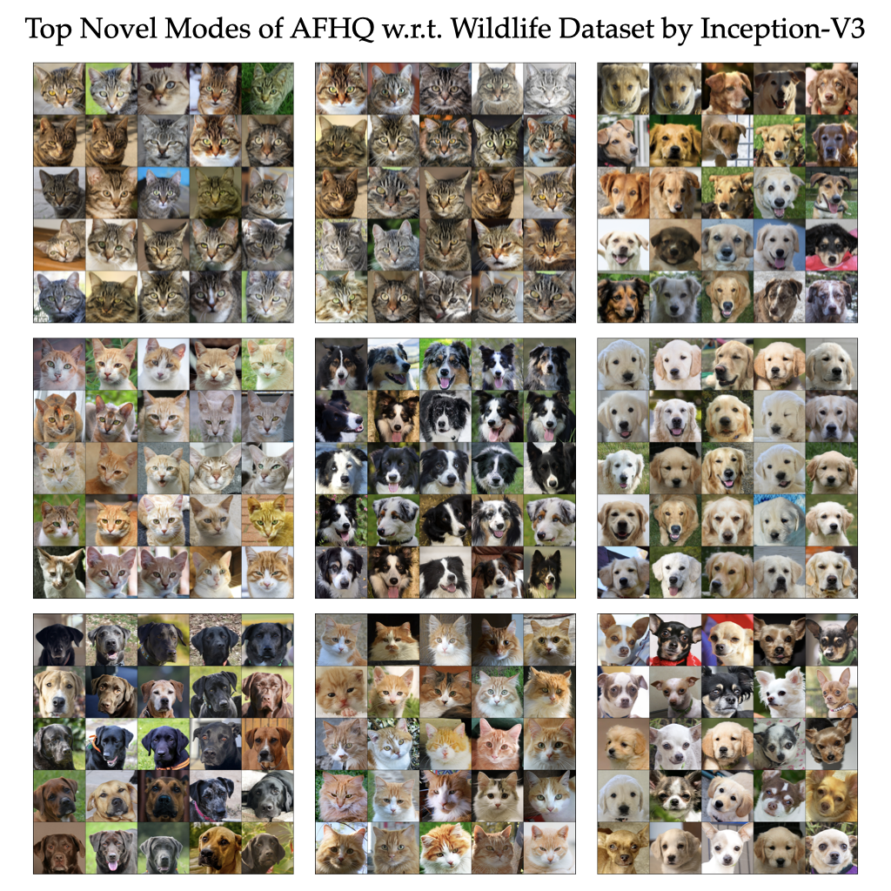
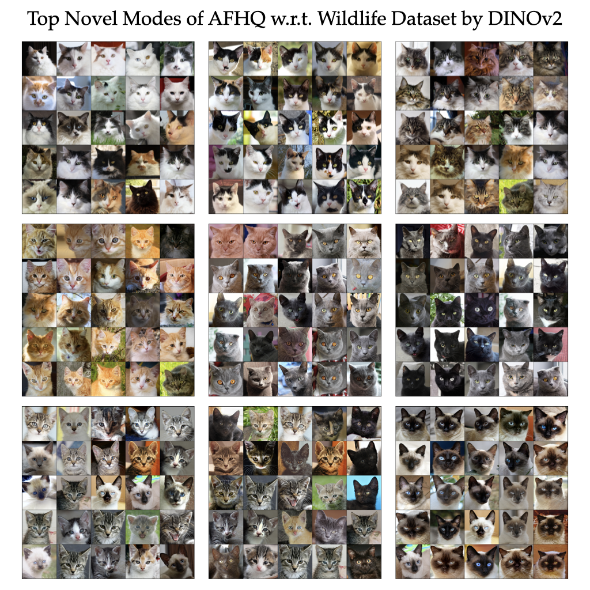
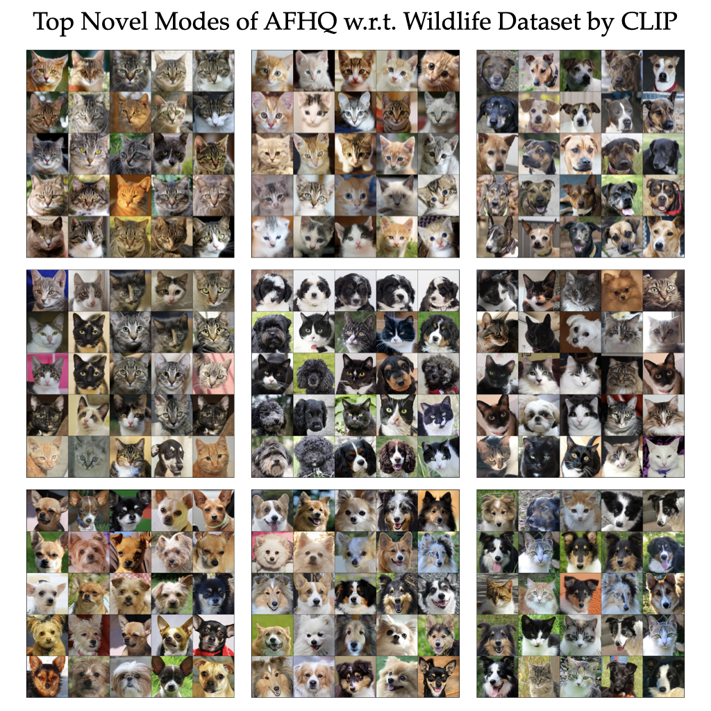
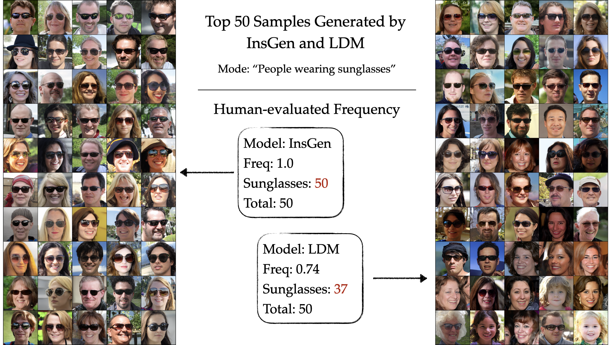

# Anonymous Project

This repository provides an official implementation of a paper that under double-blind review. The repository will be de-anonymized and released to the public after the review process.

## Quick Access
[Code Descriptions](#quick-start) <br>
[Inception-V3 Example](#example-1) <br>
[DINOv2 Example](#example-2) <br>
[CLIP Example](#example-3) <br>
[Qualitative Comparison between FLD, Rarity, and KEN](#qualitative-comparison-between-fld-rarity-score-and-ken) <br>

## Quick Start
Pipeline:
<ol>
    <li> Initialize KEN evaluator </li>
    <li> Select feature extractor (Currently support <a href='https://arxiv.org/abs/1512.00567'> Inception-V3</a>, <a href='https://arxiv.org/abs/2304.07193'> DINOv2</a>, <a href='https://arxiv.org/abs/2103.00020'> CLIP</a>)
    <li> Compute KEN score and visualize novel modes </li>
</ol>

<br>

```python 
from KEN.metric.KEN import KEN_Evaluator

# Core object for calculate KEN score and retrieve image modes
evaluator = KEN_Evaluator(logger_path: str, # Path to save log file
                          batchsize: int, # Batch size
                          sigma: int, # Bandwidth parameter in RBF kernel
                          eta: int, # Novelty threshold
                          num_samples: int, # Sampling number for EACH distribution
                          result_name: str) # Unique name for saving results

# Select feature extractor
evaluator.set_feature_extractor(name: str = 'dinov2', # feature extractor ['inception', 'dinov2', 'clip']
                                save_path: str | None = './save') # Path to save calculated features for reuse

# Calculate KEN score and visualize novel modes of test_dataset w.r.t. ref_dataset
evaluator.compute_KEN_with_datasets(test_dataset: torch.utils.data.Dataset,
                                    ref_dataset: torch.utils.data.Dataset,
                                    cholesky_acceleration: bool = True, # If true, enable Cholesky acceleration
                                    retrieve_mode: bool = False) # If true, visualize top novel modes, save to './visuals/modes/' by default
```

## Examples for More Functionality
### Save Extracted Features and Indexes for Further Use
In some cases, we may save the extracted features to reduce repeating computation (e.g. tuning bandwidth parameter, novelty threshold). We may specify the folder to save and load features:
```python
evaluator.set_feature_extractor(name = 'dinov2', # feature extractor ['inception', 'dinov2', 'clip']
                                save_path = './save') # Path to save calculated features for reuse
```
In this example, the evaluator will first check whether './save/dinov2/[result_name]_[other_information].pt' exists. If not, the evaluator will extract features and their indexes in the dataset, and save to this path.

### Visualize Novel Modes
KEN provides an interpretable evaluation between datasets and generative models. Users may retrieve the most similar samples belonging to the novel modes by eigenvectors. Here is an example of AFHQ w.r.t. ImageNet-dogs (novel modes are non-dog images)


### Examples of Novel Modes Detection
We provide some examples and their settings for the user to try on. We observe that all feature extractors can successfully detect novel modes, and different extractors may lead to different clustering preference (e.g. semantic/class similarity, visual similarity).

#### Example 1

KEN Parameters: 
$\sigma=15, \eta=5, \text{samples}=5000$ <br>
Feature Extractor: Inception-V3



#### Example 2

KEN Parameters: 
$\sigma=40, \eta=10, \text{samples}=5000$ <br>
Feature Extractor: DINOv2



#### Example 3

KEN Parameters: 
$\sigma=5, \eta=5, \text{samples}=5000$ <br>
Feature Extractor: CLIP



To retrieve novel modes, after setting up feature extractor, simply call:
```python
evaluator.compute_KEN_with_datasets(test_dataset: torch.utils.data.Dataset,
                                    ref_dataset: torch.utils.data.Dataset,
                                    retrieve_mode = True) # If true, visualize top novel modes, save to './visuals/modes/' by default
```
By default, the function will retrieve top-10 novel modes ranked by eigenvalues, and each mode is visualized by top-25 most similar samples by eigenvectors.

### Evaluate KEN score with Features
Users can also directly evaluate KEN score with features (in torch.Tensor format). The codebase currently does not support retrieving novel modes with features, since the visualization requires original dataset.
```python
evaluator.compute_KEN_with_features(test_feats: torch.Tensor, 
                                    ref_feats: torch.Tensor, 
                                    cholesky_acceleration : bool):
```

## Additional Results
### Qualitative Comparison between FLD, Rarity score and KEN


### Top 50 Samples Generated by InsGen and LDM on Mode "People wearing sunglasses"
InsGen have higher frequency of "people wearing sunglasses" than LDM in the top-50 generated samples.


